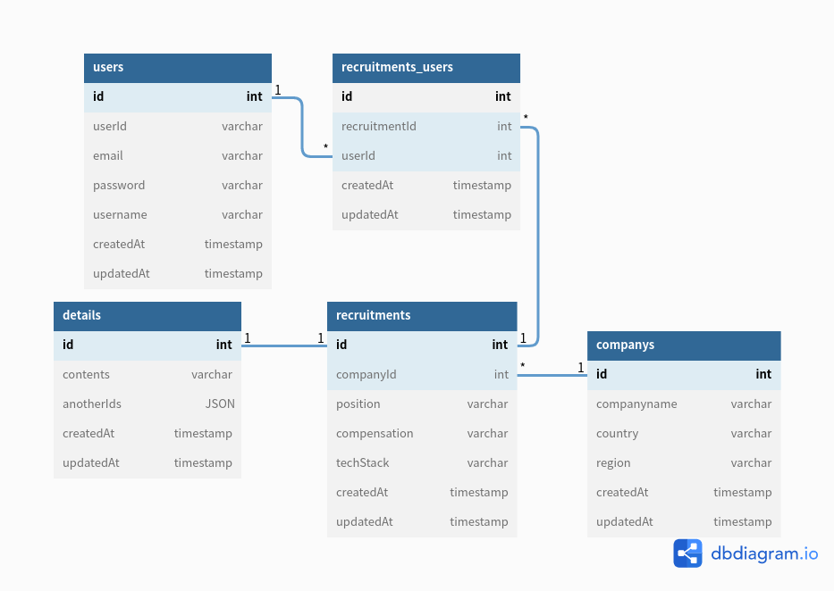

# 🐋 Welcome

**본 레포지토리는 원티드 프리온보딩 백엔드 코스 4차 선발 과제 기록들을 남긴 곳입니다.**

## ✏️ Guide

**- 아래 서비스 개요 및 요구사항을 만족하는 API 서버를 구현합니다.**

**- 사용가능  기술: Django, Node.js 중 1개의 기술**
(본 과제 수행 프레임워크는 추후 코스 팀 구성에 활용 됩니다.)

## 🏷 About

**- 본 서비스는 기업의 채용을 위한 웹 서비스 입니다.**

**- 회사는 채용공고를 생성하고, 이에 사용자는 지원합니다.**

## 🏝 Installation
**과제 수행을 위해 사용된 OS는 Ubuntu이며, 패키지 관리툴은 npm을 사용했습니다.**
```
npm install
```
**데이터베이스는 MySQL을 사용합니다.**  
**config 파일에 필요한 데이터는 환경변수로 관리되고 있습니다. `.env` 파일을 만들어 아래의 변수들을 붙여 넣고 값을 넣습니다.**
```
MYSQL_USERNAME=root
MYSQL_HOST=127.0.0.1
MYSQL_PASSWORD=password
```
## 🏔 Getting started
**터미널에서 아래 명령어 입력시 sequelize 라이브러리가 동작하여 DB를 구성한 후, 서버를 실행합니다.**
```
npm start
```

## ✏️ Feature

### - DB 스키마



## 🏷 Requirements

> **- 회사(companys)는 회사이름(companyname), 나라(country), 지역(region)을 가집니다.**
>
> **- 사용자(users)는 아이디(userId), 이메일(email), 비밀번호(password), 사용자 이름(username)을 가집니다.**
>
> **- 채용공고(recruitments)는 채용 포지션(position), 채용 보상금(compensation), 기술 스택(techStack)을 가집니다.**
>
> **- 채용공고는 상세페이지(details)에서 내용(contents), 회사에서 채용중인 다른 채용공고들(anotherIds #id List)을 추가적으로 볼 수 있습니다.**
>
> **- 회사는 여러 채용공고를 가지고, 채용공고는 하나의 회사에 속합니다.**
>
> **- 사용자는 회사의 채용공고에 지원(users_recruitments)합니다.**

## 🏝 Implements

**1. 채용공고를 등록합니다.**  
Request
```JSON
POST /api  HTTP/1.1
Host: 127.0.0.1

{
    "companyId":1,
    "position":"백엔드 개발자",
    "compensation":2500000,
    "contents":"KAKAO에서 백엔드 개발자를 채용합니다. 자격요건은..",
    "techStack":"Python"
}
```
Response: 성공
```JSON
{
    "message": "채용공고를 등록합니다."
}
```

**2. 채용공고를 수정합니다.**  
Request
```JSON
PATCH /api  HTTP/1.1
Host: 127.0.0.1

{
  "compensation":3000000,
  "contents":"KAKAO에서 백엔드 주니어 개발자를 '적극' 채용합니다. 자격요건은.."
}
```
Response: 성공
```JSON
{
    "message": "채용공고를 수정합니다."
}
```

**3. 채용공고를 삭제합니다.**  
Request
```JSON
DELETE /api?company_id=1&recruitment_id=1  HTTP/1.1
Host: 127.0.0.1
```
Response: 성공
```JSON
// 상태코드 204번이라서 반환되는 JSON이 없습니다.
```

**4. 채용공고 목록을 가져옵니다.**  
**4-1. 채용공고 목록을 가져옵니다.**  
Request
```JSON
GET /api/:id  HTTP/1.1
Host: 127.0.0.1
```
Response: 성공  
```JSON
{
    "data": {
        "id": 1,
        "position": "백엔드 개발자",
        "compensation": "3000000",
        "techStack": "C#",
        "companyname": "NAVER",
        "country": "한국",
        "region": "경기",
        "contents": "NAVER에서 백엔드 주니어 개발자를 '적극' 채용합니다. 자격요건은..",
        "anotherIds": [
            2
        ]
    },
    "message": "채용공고를 가져옵니다."
}
```
**4-2. 채용공고 검색기능을 구현합니다.**  
Request
```JSON
POST /api/some/url?search=naver  HTTP/1.1
POST /api/some/url?search=NodeJS  HTTP/1.1
Host: 127.0.0.1
```
Response: 성공 
```JSON
{
    "data": [
        {
            "id": 1,
            "position": "백엔드 개발자",
            "compensation": "2000000",
            "techStack": "C#",
            "companyname": "NAVER",
            "country": "한국",
            "region": "경기"
        },
        {
            "id": 2,
            "position": "백엔드 개발자",
            "compensation": "2500000",
            "techStack": "JAVA",
            "companyname": "NAVER",
            "country": "한국",
            "region": "경기"
        }
    ],
    "message": "채용공고 목록을 가져옵니다."
}
```

**5. 채용 상세 페이지를 가져옵니다.**  
Request
```JSON
GET /api/:id  HTTP/1.1
Host: 127.0.0.1
```
Response: 성공 
```JSON
{
    "data": {
        "id": 1,
        "position": "백엔드 개발자",
        "compensation": "3000000",
        "techStack": "C#",
        "companyname": "NAVER",
        "country": "한국",
        "region": "경기",
        "contents": "NAVER에서 백엔드 주니어 개발자를 '적극' 채용합니다. 자격요건은..",
        "anotherIds": [
            2
        ]
    },
    "message": "채용공고를 가져옵니다."
}
```

**6. 사용자는 채용공고에 지원합니다(사용자는 1회만 지원 가능).**  
Request
```JSON
POST /api/apply  HTTP/1.1
Host: 127.0.0.1

{
    "userId":1,
    "recruitmentId":3
}
```
Response: 성공 
```JSON
{
    "message": "채용공고에 지원합니다."
}
```
Response: 성공(중복 지원시 메세지) 
```JSON
{
    "message": "사용자는 1회만 지원 가능합니다."
}
```
